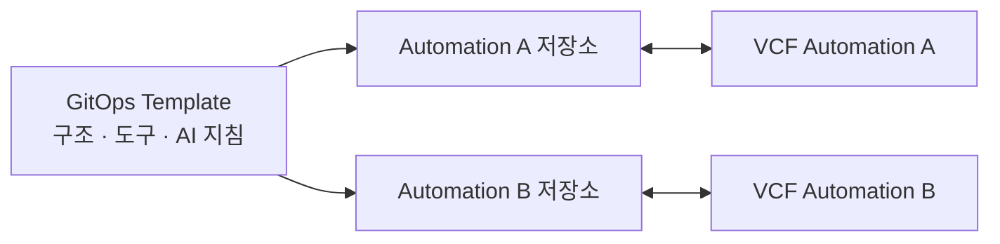

# VCF Automation GitOps Template

Automation UI에 직접 접근하지 않고 VMware Cloud Foundation Automation과 Orchestrator를 Git으로 관리하는 **인스턴스 저장소 템플릿**입니다.

이 템플릿 자체는 실제 Automation 인스턴스의 원하는 상태를 보관하지 않습니다. 템플릿으로 생성한 저장소 하나가 Automation 한 대를 관리하며, 생성된 저장소의 `main` 브랜치가 해당 인스턴스의 승인된 원하는 상태가 됩니다.

## 운영 모델



- 이 저장소: 공통 구조, CLI, 문서, AGENTS, Skill, Loop 예시 관리
- 생성된 저장소: `instance.yaml`, 실제 콘텐츠, lifecycle 분류와 릴리스 관리
- 비밀값과 캐시: `secrets.json`, token, discovery cache와 Terraform state는 어느 브랜치에도 커밋하지 않음
- 여러 Automation: 환경 브랜치가 아니라 저장소를 추가하여 격리

Template Repository와 버전 정책은 [템플릿 운영 문서](docs/TEMPLATE.md), 브랜치와 실제 연동 검증은 [브랜치 전략](docs/BRANCHING.md)을 참고합니다.

## 관리 범위

- Day-0 기반: Cloud Account, Cloud Zone, Network/Storage/Image Profile, Project
- Automation 콘텐츠: Blueprint, ABX, Catalog Source, Custom Form, Custom Resource, Resource Action, Policy, Subscription
- Orchestrator 콘텐츠: Workflow, Action, Configuration, Resource, Package
- GitOps 전달: import, status, pull, push, release, restore
- AI 운영 계층: `AGENTS.md`, Skills, 결정론적 Tools, 승인 기반 Loops

Day-0/1/2는 콘텐츠의 서비스 수명주기입니다. `pull`, `push`, `backup`, `restore`는 모든 단계를 지원하는 전달 기능입니다. 자세한 정의는 [수명주기 문서](docs/LIFECYCLE.md)를 참고합니다.

## 저장소 생성

GitHub에서 이 저장소를 Template Repository로 설정한 뒤 **Use this template**로 Automation별 저장소를 생성합니다. 생성된 저장소에서 다음을 실행합니다.

```bash
python3 -m venv .venv
.venv/bin/python -m pip install -r tooling/vcf/requirements.txt
.venv/bin/python tooling/template/bootstrap.py \
  --name automation-seoul-dev \
  --endpoint https://automation.example.com \
  --environment-tag seoul-dev
```

명령은 `instance.example.yaml`을 바탕으로 추적 대상 `instance.yaml`을 만들고, Git에서 제외되는 `secrets.json`을 권한 `0600`으로 준비합니다. `instance.yaml`에는 연결·범위·관리 정책만 두고 Day-0 원하는 상태는 `infrastructure/`에 리소스별로 기록합니다.

```bash
.venv/bin/python tooling/vcf/configure.py validate \
  --instance instance.yaml \
  --secrets secrets.json
git add instance.yaml
```

## 템플릿에서 실제 Automation 연동 시험

템플릿 기능 개발 중에는 `integration/*` 브랜치를 짧게 사용합니다. 실제 endpoint와 자격 증명은 커밋하지 않도록 무시되는 로컬 파일을 사용합니다.

```bash
git switch -c integration/lab-connection
cp instance.example.yaml instance.local.yaml
cp secrets.example.json secrets.local.json

.venv/bin/python tooling/vcf/configure.py validate \
  --instance instance.local.yaml \
  --secrets secrets.local.json
```

먼저 범위가 작은 read-only discovery로 인증과 권한을 확인합니다. 전역 옵션은 하위 명령 앞에 둡니다.

```bash
.venv/bin/python tooling/vcf/cli.py \
  --instance instance.local.yaml \
  --secrets secrets.local.json \
  discover --kind Project
```

전체 API 조회가 성공하면 결과를 Git에서 제외되는 경로에 저장하고, 채택할 리소스를 preflight합니다.

```bash
.venv/bin/python tooling/vcf/cli.py \
  --instance instance.local.yaml \
  --secrets secrets.local.json \
  discover --output .gitops/discovery.json

.venv/bin/python tooling/vcf/cli.py \
  --instance instance.local.yaml \
  --secrets secrets.local.json \
  --infrastructure-root .gitops/infrastructure-test \
  adopt --all --kind Project --kind CloudZone --dry-run
```

preflight에 충돌이 없으면 테스트 manifest를 생성하고 원격과 다시 비교합니다. `adopt`는 로컬 파일만 만들고 Automation을 수정하지 않습니다.

```bash
.venv/bin/python tooling/vcf/cli.py \
  --instance instance.local.yaml \
  --secrets secrets.local.json \
  --infrastructure-root .gitops/infrastructure-test \
  adopt --all --kind Project --kind CloudZone

.venv/bin/python tooling/vcf/cli.py \
  --infrastructure-root .gitops/infrastructure-test \
  validate

.venv/bin/python tooling/vcf/cli.py \
  --instance instance.local.yaml \
  --secrets secrets.local.json \
  --infrastructure-root .gitops/infrastructure-test \
  status --json
```

adopt 직후 모든 항목이 `IN_SYNC`인지, 실제 응답에서 Profile 관계 필드나 Project zone assignment가 누락되지 않았는지 확인합니다. 403, 일부 endpoint 실패, ID 누락 또는 경로 충돌은 빈 결과나 부분 성공으로 처리하지 않습니다.

마지막으로 템플릿 변경만 남았는지 확인합니다.

```bash
git status --short
```

템플릿 루트의 실제 `instance.yaml`, 실제 `infrastructure/` 결과, secret, `.gitops/` cache와 시험 릴리스는 변경 집합에 포함하지 않습니다. `main`에는 재사용 가능한 코드·구조·문서만 병합합니다. 구조가 안정화된 뒤에는 템플릿으로 만든 별도의 pilot 저장소에서 최종 통합 검증하는 방식이 가장 안전합니다.

## 생성된 인스턴스 저장소 사용

### 기존 Automation 가져오기

```bash
git switch -c import/initial-baseline
.venv/bin/python tooling/vcf/cli.py discover
.venv/bin/python tooling/vcf/cli.py adopt \
  --resource CloudZone:<remote-id> \
  --resource Project:<remote-id>
.venv/bin/python tooling/vcf/cli.py validate
.venv/bin/python tooling/vcf/cli.py status
.venv/bin/python tooling/vcf/vcf_sync.py pull-all
git diff -- infrastructure content
```

인프라 manifest의 `metadata.remoteId`, 원하는 상태, 콘텐츠의 민감정보와 관리 범위를 검토한 후 PR로 `main`에 병합합니다.

Automation의 지원 대상 리소스를 모두 채택하려면 먼저 전체 preflight를 확인합니다.

```bash
.venv/bin/python tooling/vcf/cli.py adopt --all --dry-run
.venv/bin/python tooling/vcf/cli.py adopt --all
```

일부 종류만 일괄 채택하려면 `--kind Project --kind CloudZone`처럼 제한합니다. 인자 없는 `adopt`는 실행되지 않으며, `--all`은 발견된 모든 지원 리소스를 Git 관리 대상으로 삼겠다는 명시적 선택입니다. 권한·API·ID 오류나 경로 충돌이 있으면 manifest를 만들기 전에 전체 작업을 중단합니다.

### Day-0 기반 관리

```bash
.venv/bin/python tooling/vcf/cli.py validate
.venv/bin/python tooling/vcf/cli.py status --json
.venv/bin/python tooling/vcf/cli.py plan
```

`plan`은 원격을 다시 관찰하고 `.gitops/plans/<plan-hash>.json`에 불변 artifact를 만듭니다. 같은 manifest와 원격 관찰에 대한 유효한 plan은 재사용합니다. 생성·갱신 대상, before/after, manifest와 원격 관찰 hash, 만료 시각을 검토한 뒤에만 정확한 artifact와 hash를 승인합니다.

```bash
# 아래 명령은 원격을 변경합니다.
.venv/bin/python tooling/vcf/cli.py apply \
  --plan .gitops/plans/<plan-hash>.json \
  --approve-plan <plan-hash>
```

Apply는 추적된 `instance.yaml`이 있는 인스턴스 저장소에서만 실행되며, plan 생성 후 manifest나 원격 상태가 바뀌었거나 plan이 만료되면 거부됩니다. 성공한 작업도 원격을 다시 조회하여 원하는 상태와 일치해야 `VERIFIED`가 됩니다. 결과는 `.gitops/apply-results/`에 기록되고 같은 plan은 다시 실행할 수 없습니다.

신규 리소스 생성은 apply에 `--approve-create Kind:<manifest-name>`을 별도로 전달해야 합니다. 파일 삭제만으로 원격 삭제를 추론하지 않습니다. 삭제가 필요한 경우 `plan --delete Kind:<remote-id>`로 대상을 명시하고 apply에도 같은 `--approve-delete Kind:<remote-id>`를 별도로 전달해야 합니다.

`foundation/automation/terraform/`은 이전 또는 선택적 greenfield 호환 경로입니다. `management.infrastructure: native`인 저장소에서는 같은 리소스를 Terraform과 동시에 관리하지 않습니다.

### 콘텐츠 동기화

```bash
.venv/bin/python tooling/vcf/vcf_sync.py status
.venv/bin/python tooling/vcf/vcf_sync.py pull
.venv/bin/python tooling/vcf/vcf_sync.py push --dry-run
# 검토와 승인 후에만 실행
.venv/bin/python tooling/vcf/vcf_sync.py push
```

### 릴리스와 복구

```bash
.venv/bin/python tooling/vcf/vcf_release.py backup --version 1.0.0
.venv/bin/python tooling/vcf/vcf_release.py restore --version 1.0.0
```

`restore`, `push`, 향후 native `apply`, `terraform apply`는 원격 환경을 변경하므로 대상과 계획을 검토하고 승인 후 실행합니다.

## 주요 경로

```text
instance.example.yaml   템플릿용 인스턴스 정의 예시
infrastructure/         리소스별 Day-0 원하는 상태와 원격 ID
foundation/             이전/선택적 Day-0 Terraform
content/                Automation과 Orchestrator 콘텐츠
lifecycle/              Day-0/1/2 분류 manifest
tooling/vcf/            설정, API client, sync, release CLI
tooling/template/       인스턴스 저장소 초기화 도구
releases/               버전 릴리스 아티팩트
automation/loops/       향후 승인 기반 loop 정의
.agents/skills/         Codex 작업 절차
```

## AI 구조

- [AGENTS.md](AGENTS.md): 템플릿과 인스턴스 저장소의 전체 정책
- [.agents/skills/vcf-gitops-lifecycle/SKILL.md](.agents/skills/vcf-gitops-lifecycle/SKILL.md): 수명주기 작업 절차
- `tooling/vcf/`: AI와 사람이 함께 사용하는 결정론적 도구
- [automation/loops](automation/loops): observe, plan, approval, apply, verify 흐름

## 문서

- [템플릿 운영](docs/TEMPLATE.md)
- [저장소 구조](STRUCTURE.md)
- [인스턴스와 비밀값 설정](docs/CONFIGURATION.md)
- [Day-0/1/2 정의](docs/LIFECYCLE.md)
- [브랜치 전략](docs/BRANCHING.md)
- [Loop 설계](docs/LOOP.md)
- [마이그레이션 상태](docs/MIGRATION.md)

## License

[MIT License](LICENSE)
