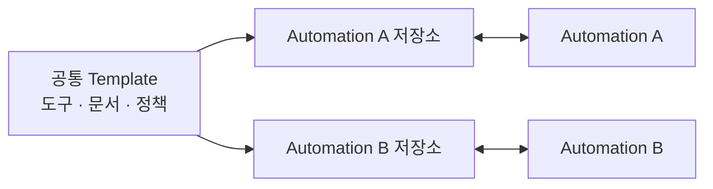

# VCF Automation GitOps Template

VMware Cloud Foundation Automation과 Orchestrator를 Git의 승인된 원하는 상태로 관리하기 위한 **인스턴스 저장소 템플릿**입니다.

원본 Template 저장소는 실제 Automation 상태를 보관하지 않습니다. GitHub의 **Use this template**로 만든 저장소 하나가 Automation 인스턴스 하나를 관리하고, 생성된 저장소의 `main`이 해당 인스턴스의 승인된 원하는 상태가 됩니다.


```mermaid
flowchart LR
    Template[공통 Template<br/>도구 · 문서 · 정책] --> RepoA[Automation A 저장소]
    Template --> RepoB[Automation B 저장소]
    RepoA <--> AutomationA[Automation A]
    RepoB <--> AutomationB[Automation B]
```

## 현재 활용 범위

현재 버전은 **개발 인스턴스의 로컬 수동 운영**을 기준으로 합니다.

| 영역 | 상태 |
| --- | --- |
| 저장소 bootstrap과 설정 검증 | 사용 가능 |
| Day-0 discovery, adopt, status | 사용 가능 |
| 콘텐츠 status, pull preview, baseline 수용 | 사용 가능 |
| Day-0 승인 기반 plan/apply/verify | 구현·로컬 테스트 완료, 개발환경 Pilot 권장 |
| Automation 콘텐츠 저위험 변경과 복구 | 개발환경 Pilot 완료 |
| Release export/build와 restore | 구현·로컬 테스트 완료, 실제 복구 Pilot 권장 |
| Observe-only Loop | 사용 가능 |
| External Orchestrator endpoint와 package discovery | 구현·로컬 검증 완료, 실제 환경 통합 검증 필요 |
| 무인 reconcile 또는 CI 자동 apply | 미지원, TICKET-015로 유예 |
| Production 확대 | 별도 검증과 승인 필요 |

원격 변경은 자동으로 실행되지 않습니다. Plan artifact와 exact hash를 사람이 검토하고 승인해야 하며, plan 이후 Git·로컬 콘텐츠·원격 상태가 달라지면 apply를 거부합니다.

## 처음 시작하기

전체 절차는 [시작 가이드](docs/GETTING_STARTED.md)를 따릅니다. 아래는 생성된 저장소에서 실행하는 최소 흐름입니다.

```bash
python3 -m venv .venv
.venv/bin/python -m pip install -r tooling/vcf/requirements.txt

.venv/bin/python tooling/template/bootstrap.py \
  --name automation-seoul-dev \
  --endpoint https://automation.example.com \
  --environment-tag seoul-dev \
  --package-name com.example.automation.seoul.dev
```

다음 두 파일을 실제 환경에 맞게 수정합니다.

- `instance.yaml`: `spec.gitops.projects`, Embedded/external Orchestrator 설정과 관리 범위
- `secrets.json`: `automation.refresh_token`; 이 파일은 Git에 커밋하지 않음

```bash
.venv/bin/python tooling/vcf/configure.py validate \
  --instance instance.yaml \
  --secrets secrets.json

git add instance.yaml
git commit -m "chore: initialize automation instance"
.venv/bin/python tooling/vcf/cli.py context --json
```

`repositoryMode: instance`, `baselineTracked: true`, `configValid: true`를 확인합니다. 기존 Automation을 연결하는 경우 원격 mutation 전에 반드시 [시작 가이드의 baseline import](docs/GETTING_STARTED.md#5-기존-automation-baseline-가져오기)를 완료합니다.

첫 연결은 read-only 조회로 확인합니다.

```bash
.venv/bin/python tooling/vcf/cli.py discover --kind Project
.venv/bin/python tooling/vcf/vcf_sync.py status --json
```

## 운영 흐름

```text
원격 상태 가져오기: status → pull-preview → review → accept-pull → PR
Git 상태 적용하기: status → plan → review/approval → apply → verify
릴리스 복구하기:   export/release-build → verify → restore-plan → approval → restore-apply
```

구체적인 명령과 실패 시 중단 기준은 [로컬 수동 운영 가이드](docs/OPERATIONS.md)를 참고합니다.

## 관리 범위

- Day-0: Cloud Account, Cloud Zone, Network/Storage/Image Profile, Project
- Automation 콘텐츠: Blueprint, ABX, Catalog Source, Custom Form, Custom Resource, Resource Action, Policy, Subscription
- Orchestrator 콘텐츠: Workflow, Action, Configuration, Resource, Package
- 전달 기능: import/adopt, status, pull, plan/apply, release, restore
- 운영 계약: AGENTS, Skill, schema, policy, observe-only Loop

Day-0/1/2는 서비스가 사용되는 시점을 나타냅니다. Import, sync와 release는 모든 Day를 지원하는 전달 기능입니다. 자세한 분류는 [수명주기 문서](docs/LIFECYCLE.md)를 참고합니다.

## 템플릿과 인스턴스 저장소

| 구분 | Template 저장소 | 생성된 인스턴스 저장소 |
| --- | --- | --- |
| `main`의 의미 | 재사용 가능한 공통 구조 | 한 Automation의 승인된 원하는 상태 |
| `instance.yaml` | 없음 | 추적 |
| 실제 `content/`, `infrastructure/` | 없음 | 추적 |
| `secrets.json`, `.gitops/` | 제외 | 제외 |
| 원격 mutation | 금지 | 유효한 plan과 승인 후 가능 |

여러 Automation은 브랜치가 아니라 저장소를 추가해 격리합니다. 템플릿의 실제 연동 시험은 `integration/*` 브랜치와 `instance.local.yaml`, `secrets.local.json`, `.gitops/infrastructure-test/`만 사용합니다.

## 템플릿 변경 반영

GitHub Template로 만든 저장소는 원본 변경을 자동 상속하지 않습니다. 새 템플릿 checkout의 updater로 먼저 preview합니다.

```bash
git switch -c feature/template-0.3.3
python3 ../vra-vro-gitops/tooling/vcf/template_update.py \
  --source ../vra-vro-gitops \
  --destination . \
  --json
```

`spec.migrations`가 비어 있지 않으면 보호된 `instance.yaml`을 먼저 직접 수정해야 합니다. `migrations: []`를 확인한 뒤 공통 파일을 적용합니다.

```bash
python3 ../vra-vro-gitops/tooling/vcf/template_update.py \
  --source ../vra-vro-gitops \
  --destination . \
  --apply \
  --approve-version 0.3.3

python3 -m unittest discover -s tests
python3 tooling/vcf/schema_validation.py
git diff
```

Updater는 `instance.yaml`, `content/`, `infrastructure/`, `lifecycle/`, secret, release와 `.gitops/`를 변경하지 않습니다. 자세한 내용은 [템플릿 운영 문서](docs/TEMPLATE.md)를 참고합니다.

## CLI 사용 기준

0.x 문서의 기준 명령은 저장소에 포함된 다음 script입니다.

- Day-0: `tooling/vcf/cli.py`
- 콘텐츠: `tooling/vcf/vcf_sync.py`
- 릴리스: `tooling/vcf/vcf_release.py`
- 설정: `tooling/vcf/configure.py`

`pyproject.toml`로 wheel을 설치한 환경에서는 `vcf-gitops` 통합 entry point를 사용할 수 있습니다. 기존 script 경로의 제거 여부는 1.0 전에 다시 결정합니다.

## 안전 경계

- Template 또는 모호한 저장소 모드에서는 원격 mutation을 실행하지 않습니다.
- 인증·권한·API·페이지네이션·응답 해석 중 하나라도 실패하면 빈 상태로 계속하지 않습니다.
- `pull`은 preview를 만들 뿐 `content/`를 바로 변경하지 않습니다.
- Git에서 파일이 사라졌다는 이유만으로 원격 리소스를 삭제하지 않습니다.
- `push`, `push-all`과 direct `restore`는 비활성화되어 있습니다.
- 실제 secret, cache, state와 원격에서 가져온 인스턴스 전용 데이터는 Template 저장소에 커밋하지 않습니다.

## 문서

- [처음 시작하기](docs/GETTING_STARTED.md)
- [로컬 수동 운영](docs/OPERATIONS.md)
- [인스턴스와 비밀값 설정](docs/CONFIGURATION.md)
- [템플릿 운영과 업데이트](docs/TEMPLATE.md)
- [저장소 구조](STRUCTURE.md)
- [Day-0/1/2 정의](docs/LIFECYCLE.md)
- [콘텐츠 Identity와 정규화](docs/CONTENT_IDENTITY.md)
- [Schema, Policy와 CI](docs/SCHEMA_POLICY.md)
- [브랜치 전략](docs/BRANCHING.md)
- [Loop 설계](docs/LOOP.md)
- [마이그레이션 상태](docs/MIGRATION.md)

## License

[MIT License](LICENSE)
