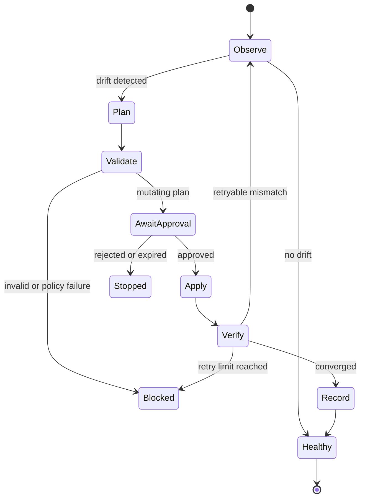

# 향후 GitOps loop 설계

Loop는 단순 반복 실행이 아니라, 관찰한 상태를 원하는 상태에 안전하게 수렴시키는 제어 흐름입니다. 현재 저장소에는 loop 실행기가 없으며 이 문서는 구현 계약을 정의합니다.

## 상태 머신



## 단계 계약

1. **Observe**: `status`와 API 조회로 현재 상태를 읽고 정규화된 drift를 생성합니다.
2. **Plan**: drift를 Day, 제품, 환경, 위험도로 분류하고 실행 가능한 변경 집합을 만듭니다.
3. **Validate**: 구문·스키마·참조·정책·dry-run을 통과해야 합니다.
4. **AwaitApproval**: 원격 mutation은 명시적 승인 토큰 또는 승인된 실행 컨텍스트를 요구합니다.
5. **Apply**: 승인된 변경 집합만 적용하며 범위를 실행 중 확대하지 않습니다.
6. **Verify**: 다시 관찰하여 기대 상태와 실제 상태가 수렴했는지 확인합니다.
7. **Record**: 입력 hash, 대상, 명령, 결과, 검증 증거, 릴리스 버전을 남깁니다.

## 안전장치

- 환경별 동시 실행 잠금과 idempotency key를 사용합니다.
- 기본 모드는 observe-only이며, mutation은 별도 정책으로 활성화합니다.
- 인증·권한·스키마·정책 오류는 재시도하지 않습니다.
- 네트워크나 일시적 서버 오류만 제한된 횟수로 backoff 재시도합니다.
- 같은 drift가 반복되거나 검증 후에도 수렴하지 않으면 중단하고 사람에게 인계합니다.
- 한 loop가 Day-0, Day-1, Day-2를 임의로 넘나들지 않습니다. 단계 전환은 별도 승인 이벤트입니다.
- `restore`, `push-all`, `terraform apply` 같은 큰 blast radius 작업은 무인 기본 동작으로 두지 않습니다.

## 제안하는 정의 형식

향후 `automation/loops/{name}.yaml`은 최소한 다음 필드를 갖습니다.

```yaml
apiVersion: gitops.vcf.example/v1alpha1
kind: ReconciliationLoop
metadata:
  name: dev-day2-drift
spec:
  environment: dev
  lifecycle: day2
  products: [automation, orchestrator]
  interval: 15m
  mode: observe
  retry:
    maxAttempts: 3
  approval:
    requiredFor: [push, push-all, restore, terraform-apply]
```

스키마와 실행기를 구현하기 전에는 이 예시를 실제 자동 실행 설정으로 간주하지 않습니다.

## 구현 순서

1. `status` 결과를 안정적인 JSON으로 출력하는 read-only observe 인터페이스
2. 환경·제품·리소스별 plan 스키마와 정책 검증
3. 실행 기록과 lock 저장소
4. 승인된 개발 환경 Day-2 변경에 한정한 apply/verify
5. 충분한 운영 증거가 쌓인 뒤 Day-1 승격 연계 검토

Day-0 자동 apply와 운영 환경 무인 mutation은 별도 위험 검토 대상으로 남깁니다.
